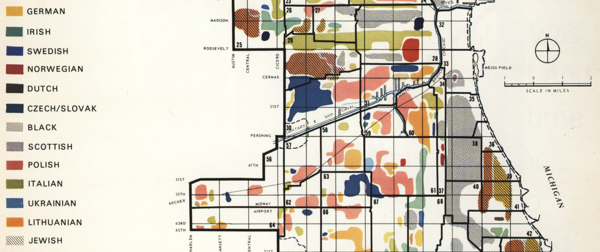

# Tribes
A map of aggregate racial/ancestral groups based on [a 1950 map of Chicago](https://upload.wikimedia.org/wikipedia/commons/b/b5/Chicago_Demographics_in_1950_Map.jpg).



## Background
This is a tough map to recreate with 21st century data. The reason for using an aggregate approach is that the census [only reports ancestry for slightly more than half of the US population](http://factfinder.census.gov/faces/tableservices/jsf/pages/productview.xhtml?pid=ACS_13_5YR_B04001&prodType=table), including in configurations that fail to represent whole racial/ethnic groups, which are in turn detailed on other tables. In order to capture the conceptual spirit and geographic detail of the original map, it is worthwhile to combine the two in the most-representative way possible.

This map draws from [99 distinct ancestry/race/ethnicity/origin categories from across 5 census tables](data/census_community_fields.csv) to produce maps [like this](data/communities_17_031.geojson).

## Data sources
 - [Census TIGER geographic boundaries - tract-level](data/cook_county_blocks.geojson)
 - [Census API SF1 and ACS](http://api.census.gov/data/2010/sf1/variables.html)
 - [Zillow neighborhoods](data/zillow_neighborhoods.geojson)  
 - [Cook County GIS](https://datacatalog.cookcountyil.gov/)
 - [OSM Metro extracts](https://mapzen.com/data/metro-extracts/)

*Processed Geographic Data*  
`merged-non-resi.shp`: Combination of OSM rail line buffer, OSM non-residential land uses, Chicago parks, Chicago parcels with a `taxcode != 1`, and buildings with non-residential tags. Used [Mapshaper](www.mapshaper.org) at the end to slim down the file.
`roadedge_buff5.shp`: This was a doozy. Cook County road edge file was a giant mess. Buffered 5' it w/ dissolve to clean it up, then map-shaped it to reduce the file size.    


## Processing steps
 1. [Hit the Census API for tabular data](processing/pull/index.js)]
 2. Add `largest_group` aggregate field, populated with largest ancestry/racial/ethnic group in each census tract by proportion of the population; retain proportion stats
 3. Get geodata
 4. Join tract geometries, `community`, ancestry and race tables on geoid
 5. Delete empty tracts
 6. Expand block boundaries by 50m, dissolve, then erode by 150m and simplify a bit for cartographic effect
 7. Map [according to original style](cartography/chicago_demographics.mss)

## Usage

### Dependencies

- [node.js](https://nodejs.org/en/)
- [GDAL/OGR](http://trac.osgeo.org/gdal/wiki/DownloadingGdalBinaries)
- [PostGIS](http://postgis.org)
- [csvkit](http://csvkit.readthedocs.org/en/540/)
- Census [API key](http://api.census.gov/data/key_signup.html)

In theory this will work for any county in the country. Set location parameters as arguments in the order below:

```bash
bash build_communities.sh <State name> <state abbreviation> <state_fips> <county_fips> <census key>
```

e.g. this:
```
bash build_communities.sh "New York" ny 36 081 <census_api_key>
```
 . . . will get you a map of Queens, NY

## Assumptions (a running list)
 - __Meta-assumption: ancestry can be inferred by race.__ This is a dramatic oversimplification, to say the least.
 - Census categories that dance around race, ancestry and ethnicity can be coherently flattened to a non-overlapping set of categories.
 - Counting multiple races as multiple people is legit, when trying to show community membership.
 - Asian and Hispanic/Latino groups can be represented by race in the absence of ancestral categories encompassing them.
 - In majority-black census blocks, "American" ancestry refers almost exclusively to African-Americans.
 - The "Mixed" racial group in a block is adequately represented by the largest ancestral group in the containing tract.
 - "Hispanic/Latino" can be [represented as a race-like category](http://censusreporter.org/topics/race-hispanic/).
 - Margin of error can be ignored.
